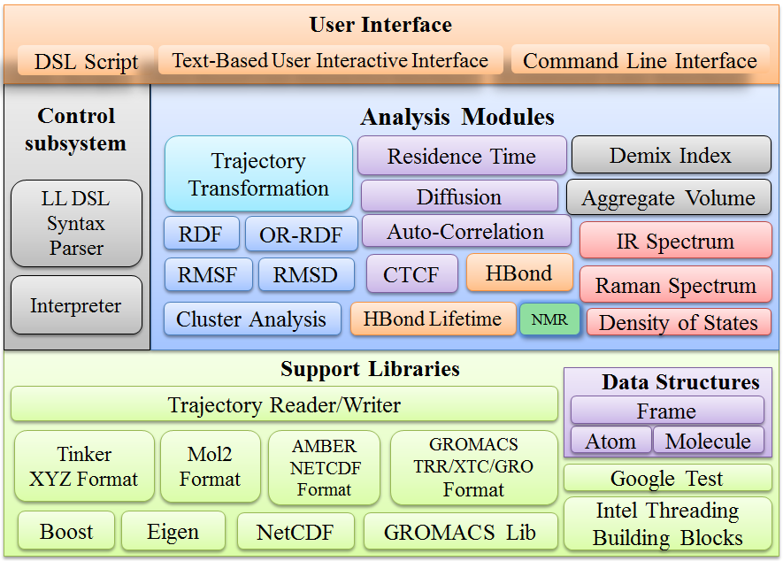
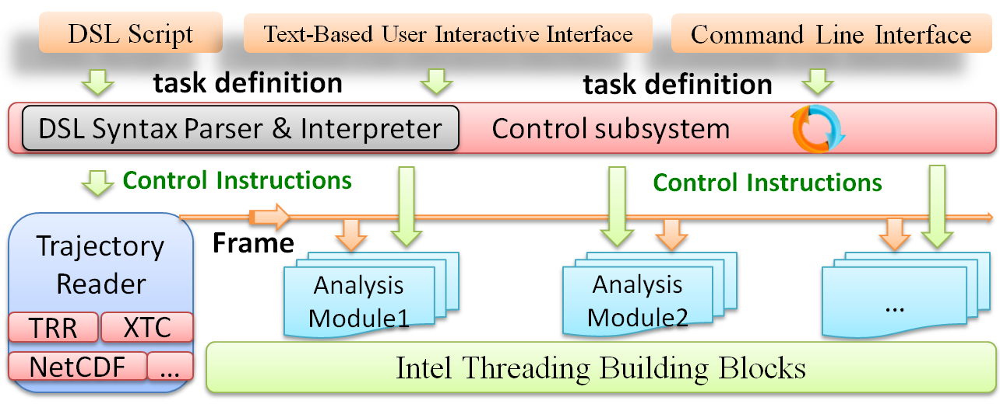

## Molecular dynamics trajectory analysis package for Tinker & Gromacs software

#### Archtecture

#### Function enhancement to MD Engine

1. add discrete charge transfer term to AMOEBA polarizable force field
2. add binary trajectory format (NetCDF,from Amber) support in molecular dynamics and post-analysis program

#### Typical analysis functions
 
1.   trajectory format conversion between Tinker ARC, Gromacs Trr, Gromacs Xtc, Gromacs Gro and Amber Netcdf
2.   Diffusion coefficient based on Einstein and Green-Kubo equation
3.   Hydrogen bond analysis
4.   Rotational autocorrelation function
5.   NMR NOE calculation
6.   Water residence time
7.   Cluster analysis based on linkage method
8.   Aggregation volume calculation for specific molecule
9.   IR & Raman Spectrum calculation
10.  Density of State (DOS) Spectrum
11.  Hydrogen bond lifetime analysis
12.  Various angle related analysis and can convert probability distribution to Gibbs free energy plot
13.  Orientation-Resolved Radial Distribution Functions (JCTC 2019, 15, 803−812)
14.  Conditional Time Correlation Function (JCTC 2019, 15, 803−812)
15.  Radius of gyration (mass-weighted)
16.  Use AmberMask for selecting Residues, Atoms in topology structure
17.  Use Domain Specific Language(DSL) script to drive analysis process 
18.  Other practical utilities for using Tinker

#### Build Requirements
- Language : C++17 ( GCC 7.x or above ) and its STL
- Build System :  CMake 3.13 or above
- Third-party libraries :  Boost 1.67 or above,
                           Intel Threading Building Blocks(TBB) ( for Multi-Core Parallelism ), 
                           NetCDF,  FFTW3 , 
                           GROMACS library ( for reading and writting Gromacs topology and trajectory file ),
                           Google Test ( for unit test ),
                           Eigen 3.3 ( C++ template library for linear algebra )
                           
#### ExecutionFlow

                           

 
